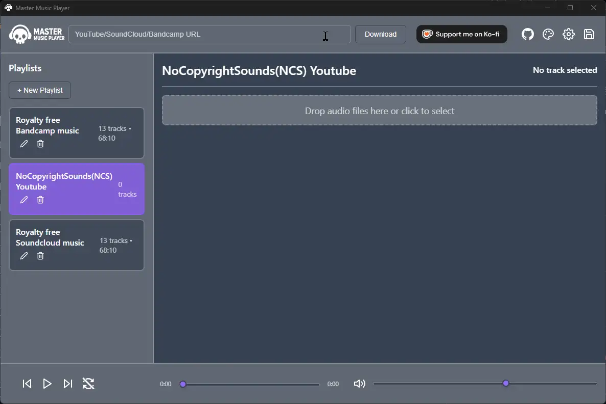
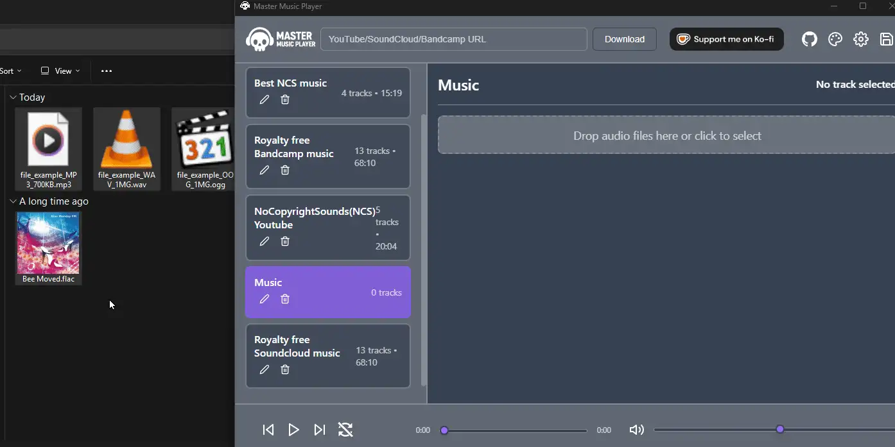
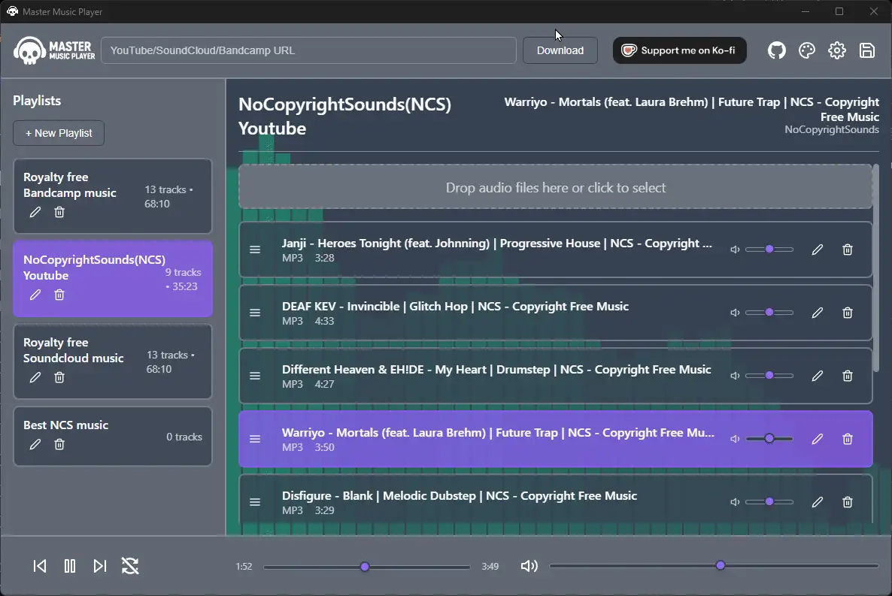
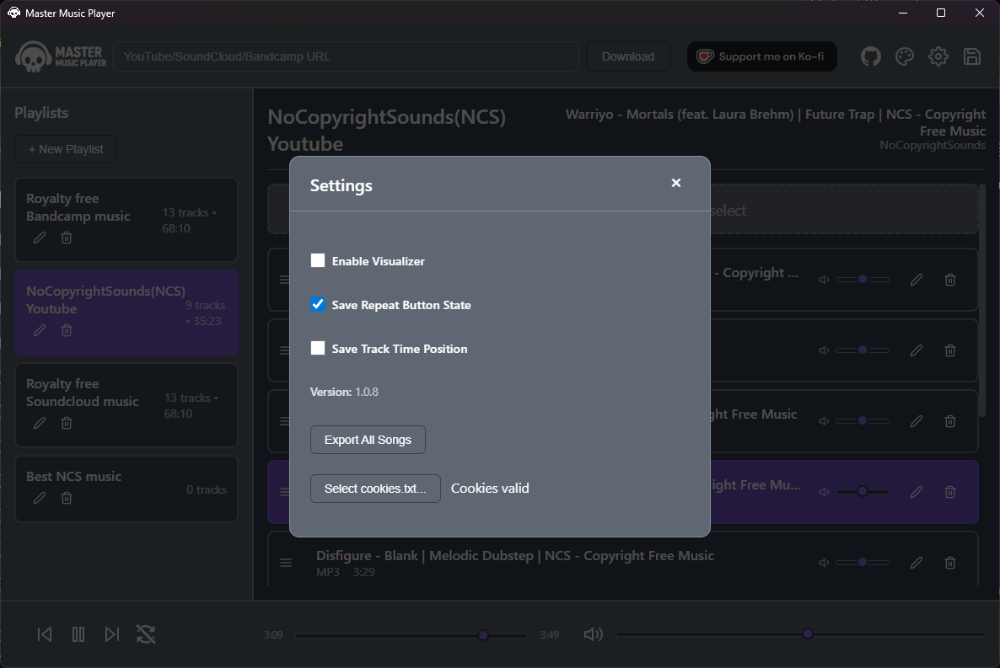
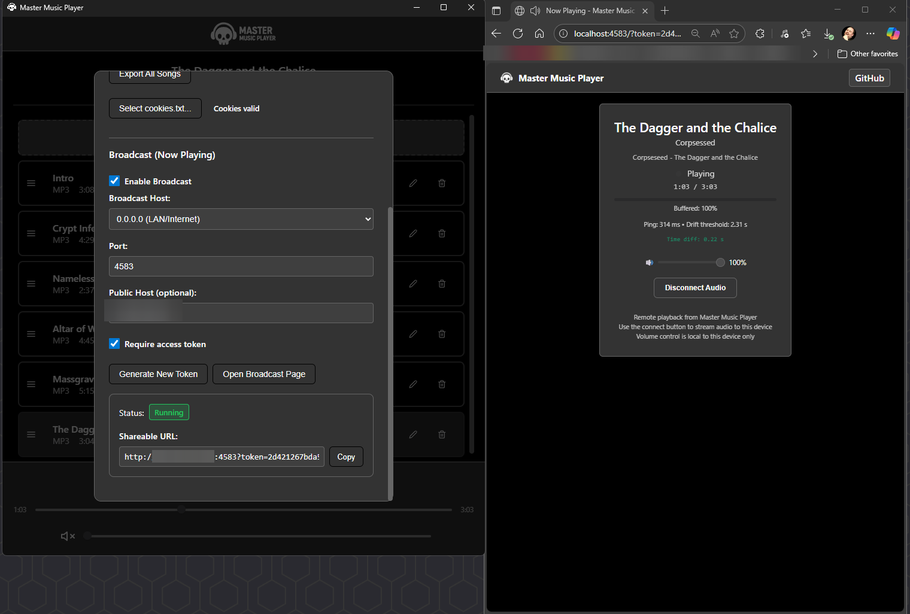

<a href="https://ko-fi.com/r60dr60d" target="_blank"></a>

# Master Music Player

An Electron-based music player that serves as a wrapper for [yt-dlp](https://github.com/yt-dlp/yt-dlp), providing an intuitive interface for downloading and managing music from YouTube, SoundCloud, and Bandcamp.

## Features

### Core Functionality
- **Multi-source Downloads**: Download music from YouTube, SoundCloud, and Bandcamp using yt-dlp.
- **Age-Restricted Content Support**: Integrated cookies.txt handling for downloading age-restricted YouTube videos with smart fallback strategies.
- **Playlist Management**: Create, rename, and delete playlists with shuffle and repeat modes.
- **Audio Playback**: Support for FLAC, MP3, OGG, and M4A formats with per-track volume control.
- **Music Visualizer**: Real-time audio visualization with customizable themes.
- **Drag & Drop**: Add local files and reorder tracks within and between playlists.
- **Remote Broadcasting**: Stream music to other devices on your network with real-time synchronization.

## Visual Showcase


*Downloading playlists with age-restricted content support*


*Drag & drop local music files from your computer*


*Easy backup and restore functionality*


*Comprehensive settings and configuration*


*Intuitive drag & drop file management*

### Advanced Features
- **Theme Customization**: Configurable color themes with dynamic backgrounds.
- **Backup & Restore**: Save and restore playlists and tracks.
- **Track Management**: Rename tracks, view file types, remove tracks.
- **Playlist Organization**: Drag tracks between playlists.
- **Per-track volume** Control with persistence.
- **YouTube Cookies Integration**: Upload cookies.txt files through Settings → YouTube Cookies to access age-restricted content with automatic validation and status indicators.
- **Remote Broadcasting**: Stream your music to other devices on your network with real-time synchronization.

## Broadcasting & Remote Playback



Master Music Player includes a built-in HTTP server that allows you to stream your music to other devices on your network or over the internet. This feature enables you to control playback from the main application while listening on phones, tablets, or other computers anywhere - whether on your local network or remotely when the port is open to the internet.

### Broadcasting Features

- **Real-time Audio Streaming**: Stream high-quality audio to remote devices
- **Live Synchronization**: Remote devices stay in sync with the main player
- **Seek & Control Sync**: Seeking, play/pause, and track changes are instantly reflected on all connected devices
- **Network Diagnostics**: Built-in ping measurement and drift monitoring
- **Adaptive Sync Tolerance**: Automatically adjusts sync threshold based on network latency
- **Buffer Progress**: Visual indication of download progress on remote devices
- **Secure Access**: Token-based authentication with configurable IP restrictions

### How to Use Broadcasting

1. **Enable Broadcasting**: Go to Settings → Broadcasting and enable the broadcast server
2. **Configure Network**: Set your preferred host IP and port (default: localhost:4583)
3. **Generate Access Token**: The app automatically creates a secure access token
4. **Share the URL**: Copy the generated broadcast URL and open it on any device with a web browser
5. **Connect Audio**: Click "Connect Audio" on the remote device to start streaming

### Broadcasting Settings

- **Host & Port**: Configure which network interface and port to use
- **Access Control**: Require authentication tokens and restrict by IP address
- **Public Host**: Set a custom hostname for sharing (useful for external access)
- **Security Options**: Enable HSTS headers and configure rate limiting

### Remote Interface Features

- **Live Track Info**: Shows current track name, artist, and playlist
- **Playback Controls**: Volume control independent from main app
- **Real-time Progress**: Synchronized time display with smooth updates
- **Network Status**: Displays ping latency and sync drift threshold
- **Time Difference Monitor**: Shows sync accuracy between local and remote playback
- **Buffer Visualization**: Progress bar showing audio download status

### Technical Details

- **Sync Tolerance**: Automatic drift correction based on network RTT + 2 second padding
- **Throttled Updates**: Seek operations are rate-limited to prevent network flooding
- **Server-Sent Events**: Real-time state updates for immediate synchronization
- **Fallback Heartbeat**: Periodic sync checks when SSE is unavailable
- **Caching**: Static assets are cached for 7 days to improve performance

## Keyboard Shortcuts

- **Space**: Play/Pause
- **Ctrl + Right Arrow**: Next track
- **Ctrl + Left Arrow**: Previous track
- **Ctrl + R**: Toggle repeat
- **Ctrl + S**: Toggle shuffle

## Installation

### Simple Installation (Recommended)
1. **Download** the latest installer from the [Releases](https://github.com/Ultikynnys/MasterMusicPlayer/releases) page
2. **Install** the application by running the installer
3. **Optional**: Get cookies.txt from your browser for age restriction bypass and upload it through Settings → YouTube Cookies inside the app

## Build Requirements

- **Node.js**: Version 16.x or higher. You can download it from [nodejs.org](https://nodejs.org/).
- **npm**: Should be installed with Node.js.
- **Supported OS**: Windows, macOS, and Linux.

## Building the Application

You can build the application for your current platform or for a specific one.

- **Build for current OS**:
  ```bash
  npm run build
  ```

- **Build for a specific OS (e.g., Windows)**:
  ```bash
  npm run build -- --win
  ```
  Use `--mac` for macOS or `--linux` for Linux.

The packaged application will be available in the `dist` directory.

## Configuration

You can customize the application's theme by editing the `theme.json` file located in `data/config/`. This file allows you to change the color scheme and background image of the player. 

### Audio Formats Supported
- MP3 (MPEG Audio Layer 3)
- FLAC (Free Lossless Audio Codec)
- OGG (Ogg Vorbis)
- M4A (MPEG-4 Audio)
- WAV (Waveform Audio File Format)

### Download Sources
- YouTube (videos and playlists)
- SoundCloud (tracks and playlists)
- Bandcamp (albums and tracks)

### Data Storage
- Data is stored in the following path on Windows<br>
``` C:\Users\<user>\AppData\Roaming\master-music-player\data ```

- Playlists are stored as JSON files in `data/playlists/`
- Music files are stored in `data/songs/`
- Theme configuration in `data/config/theme.json`
- Backups are stored in `data/backups/`

## Contributing

1. Fork the repository
2. Create a feature branch
3. Make your changes
4. Test thoroughly
5. Submit a pull request

## Support

For issues and feature requests, please create an issue in the repository.
