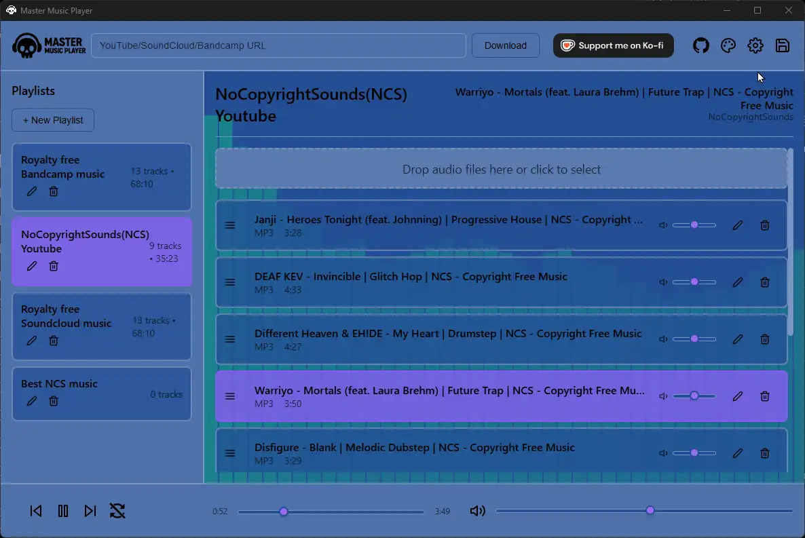
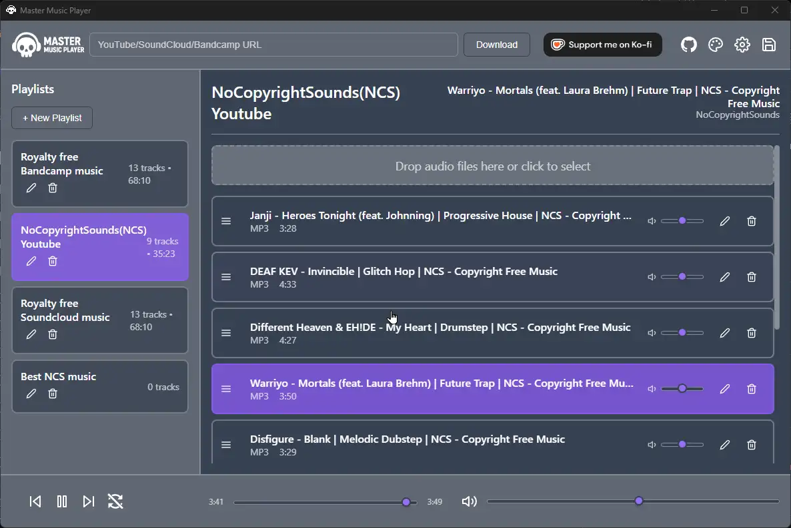

<a href="https://ko-fi.com/r60dr60d" target="_blank"></a>

# Master Music Player

A Electron-based music player that serves as a wrapper for [yt-dlp](https://github.com/yt-dlp/yt-dlp), providing an intuitive interface for downloading and managing music from YouTube, SoundCloud, and Bandcamp.

## Features

### Core Functionality
- **Multi-source Downloads**: Download music from YouTube, SoundCloud, and Bandcamp using yt-dlp.
- **Age-Restricted Content Support**: Integrated cookies.txt handling for downloading age-restricted YouTube videos with smart fallback strategies.
- **Playlist Management**: Create, rename, and delete playlists.
- **Audio Playback**: Support for FLAC, MP3, OGG, and M4A formats.
- **Music Visualizer**: Real-time audio visualization.
- **Drag & Drop**: Add local files and reorder tracks.

## Visual Showcase


*Downloading playlists with age-restricted content support*


*Drag & drop local music files from your computer*


*Customizable themes with dynamic backgrounds*


*Easy backup and restore functionality*


*Comprehensive settings and configuration*


*Intuitive drag & drop file management*

### Advanced Features
- **Theme Customization**: Configurable color themes with dynamic backgrounds.
- **Backup & Restore**: Save and restore playlists and tracks.
- **Track Management**: Rename tracks, view file types, remove tracks.
- **Playlist Organization**: Drag tracks between playlists.
- **Per-track volume** Control with persistence.
- **YouTube Cookies Integration**: Upload cookies.txt files through Settings → YouTube Cookies to access age-restricted content with automatic validation and status indicators.

## Keyboard Shortcuts

- **Space**: Play/Pause
- **Ctrl + Right Arrow**: Next track
- **Ctrl + Left Arrow**: Previous track
- **Ctrl + R**: Toggle repeat

## Installation

### Simple Installation (Recommended)
1. **Download** the latest installer from the [Releases](https://github.com/Ultikynnys/MasterMusicPlayer/releases) page
2. **Install** the application by running the installer
3. **Optional**: Get cookies.txt from your browser for age restriction bypass and upload it through Settings → YouTube Cookies inside the app

## Build Requirements

- **Node.js**: Version 16.x or higher. You can download it from [nodejs.org](https://nodejs.org/).
- **npm**: Should be installed with Node.js.
- **Supported OS**: Windows, macOS, and Linux.

## Building the Application

You can build the application for your current platform or for a specific one.

- **Build for current OS**:
  ```bash
  npm run build
  ```

- **Build for a specific OS (e.g., Windows)**:
  ```bash
  npm run build -- --win
  ```
  Use `--mac` for macOS or `--linux` for Linux.

The packaged application will be available in the `dist` directory.

## Configuration

You can customize the application's theme by editing the `theme.json` file located in `data/config/`. This file allows you to change the color scheme and background image of the player. 

### Audio Formats Supported
- MP3 (MPEG Audio Layer 3)
- FLAC (Free Lossless Audio Codec)
- OGG (Ogg Vorbis)
- M4A (MPEG-4 Audio)
- WAV (Waveform Audio File Format)

### Download Sources
- YouTube (videos and playlists)
- SoundCloud (tracks and playlists)
- Bandcamp (albums and tracks)

### Data Storage
- Data is stored in the following path on Windows<br>
``` C:\Users\<user>\AppData\Roaming\master-music-player\data ```

- Playlists are stored as JSON files in `data/playlists/`
- Music files are stored in `data/songs/`
- Theme configuration in `data/config/theme.json`
- Backups are stored in `data/backups/`

## Contributing

1. Fork the repository
2. Create a feature branch
3. Make your changes
4. Test thoroughly
5. Submit a pull request

## Support

For issues and feature requests, please create an issue in the repository.
